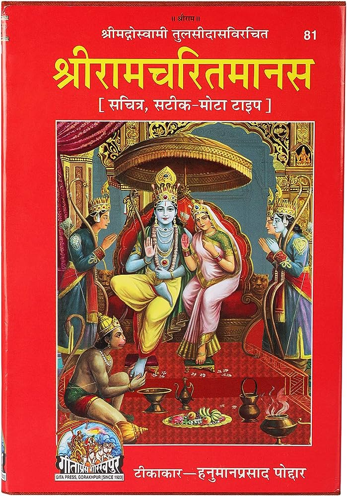

# 🕉️ Ramcharitmanas Text Analysis



An open-source NLP project that explores **Ramcharitmanas**, a sacred Hindu epic written in **Awadhi** (with Hindi meanings), using modern **Data Science and Machine Learning** tools.

This project starts from **raw PDF → structured DataFrame → rich EDA**, and will expand to include:
- 🔍 Topic Modeling
- 🧠 Question Answering
- 🪔 Sentiment & Emotion Analysis
- 🔊 Audio generation
- 🌐 Web dashboard (Streamlit)

---

## 📘 Description

Ramcharitmanas, authored by **Goswami Tulsidas**, is a poetic retelling of the Ramayana in Awadhi. This project aims to bridge ancient scripture with modern AI — analyzing themes, emotions, structure, and sentiment hidden in the verses.

---

## ✅ Features Implemented

### ✅ Phase 1: Data Preparation
- ✅ Extracted text from PDF (using PyMuPDF / pdfminer)
- ✅ Parsed and structured into:
  - `Kand` (Chapter)
  - `Verse` (Awadhi)
  - `Meaning` (Hindi)
  - `Verse Type`, `Page Number`, `Verse Count`

### ✅ Phase 2: Cleaning & EDA
- ✅ Checked missing values, duplicates, data types
- ✅ Standardized `Kand` names and verse types
- ✅ Visualized:
  - Number of verses per Kand
  - Word clouds for Awadhi & Hindi
  - Verse length distribution
  - Verse type distribution
  - Basic sentiment score trends (optional)
  - Frequent words (using tokenization & stopwords)

---

## 🛠 Tech Stack

- **Language**: Python
- **Libraries**: Pandas, NLTK, Plotly, WordCloud, Gensim, PyMuPDF
- **Dashboard**: Streamlit (for topic exploration)
- **Future NLP Tools**: spaCy, HuggingFace Transformers, IndicNLP, fastText

---

## 🔮 Roadmap

| Feature | Status |
|--------|--------|
| PDF to Text Parsing | ✅ Done |
| Text Cleaning & Structuring | ✅ Done |
| Exploratory Data Analysis (EDA) | ✅ Done |
| LDA Topic Modeling | 🔄 In Progress |
| Streamlit App: Topic Explorer | ✅ Done |
| Sentiment Analysis | 🔜 Coming Soon |
| Summarization | 🔜 Coming Soon |
| QA Bot on Verses | 🔜 Coming Soon |
| Audio Narration (TTS) | 🔜 Planned |
| Full Dashboard Deployment | 🔜 Planned |

---

## 📥 How to Run

### 1. Clone the repo

```bash
git clone https://github.com/yourname/ramcharitmanas-nlp.git
cd ramcharitmanas-nlp
```

### 2. Install dependencies

```bash
pip install -r requirements.txt
```

### 3. Run Notebooks

Use Jupyter or Colab to open and execute notebooks in `notebooks/`.

---

## 🧠 Future Ideas

- Named Entity Recognition: Character tracking (राम, लक्ष्मण, सीता...)
- Emotion trajectory of events
- Verse Similarity Clustering
- Devotion score prediction

---

## 🙏 Credits

- Original text from public domain Ramcharitmanas sources.
- Inspired by IndicNLP, Gensim, and devotional AI initiatives.

---

## 🤝 Contributions

Contributions welcome! Feel free to:
- Suggest a new NLP feature
- Improve text parsing logic
- Add a new visualization
- Translate output into English

---

## 📜 License

This project is licensed under the MIT License.
